# 1. Execution Flow Diagram

```mermaid
flowchart TD
    %% User interaction
    UserTop([User]) --> |"Executes"|SafeLauncher["Safe Launcher<br>(Python)"]
    SafeLauncher --> |"Launches"|EntryPoint["Application Entry Point"]
    
    %% Flow initialization
    EntryPoint --> |"Initializes"|FlowOrchestrator["Flow Orchestrator<br>(CrewAI Flow)"]
    FlowOrchestrator --> |"Manages"|StateHandler["State Handler<br>(Pydantic)"]
    StateHandler --> |"Updates"|ExecutionState["Execution State<br>(BaseModel)"]
    
    %% Flow execution steps
    subgraph ExecutionSteps["Execution Steps (Sequential)"]
        direction TB
        Step1["1. Data Input Processing"]
        Step2["2. Analysis Execution"]
        Step3["3. Result Persistence"]
    end
    FlowOrchestrator --> |"Executes"|ExecutionSteps
    
    %% Agent system
    Step2 --> |"Initializes"|AgentManager["Agent Manager<br>(CrewAI)"]
    AgentManager --> |"Creates"|DataQueryAgent["Data Query Agent<br>(CrewAI Agent)"]
    AgentManager --> |"Configures"|TaskDefinition["Task Definition<br>(YAML Config)"]
    TaskDefinition --> |"Guides"|TaskExecutor["Task Executor<br>(CrewAI Task)"]
    DataQueryAgent --> |"Uses"|ReasoningEngine["Reasoning Engine<br>(Azure OpenAI)"]
    
    %% Data layer
    DataQueryAgent --> |"Uses"|QueryTool["Query Tool<br>(Pandas)"]
    QueryTool --> |"Reads"|CSVDataStore[("CSV Data Store<br>(File System)")]
    QueryTool --> |"Reads"|MetadataStore[("Metadata Store<br>(JSON)")]

    %% Observability layer
    FlowOrchestrator -.-> |"Monitored by"|TracingProvider["Tracing Provider<br>(Phoenix)"]
    AgentManager -.-> |"Monitored by"|TracingProvider
    QueryTool -.-> |"Monitored by"|TracingProvider
    TracingProvider --> |"Sends Telemetry"|PhoenixBackend["Phoenix Backend<br>(Telemetry)"]

    %% Results delivery
    Step3 --> |"Writes to"|ResultStorage["Result Storage<br>(File System)"]
    ResultStorage --> |"Available to"|UserBottom([User])
    
    %% Legend with vertical layout
    subgraph Legend["Legend"]
        direction TB
        L1["User Interface"]
        L2["Main Components"]
        L3["Flow Components"]
        L4["Agent Components"]
        L5["Data Components"]
        L6["Tool Components"]
        L7["Observability"]
    end

    %% Invisible connection to position legend properly
    Legend ~~~ InvisNode
    InvisNode ~~~ UserBottom

    %% Styling with consistent colors and larger boxes
    classDef user fill:#f5f5f5,stroke:#333,stroke-width:2px,stroke-dasharray: 5 5
    classDef main fill:#f8d7da,stroke:#721c24,stroke-width:2px
    classDef flow fill:#f3e5f5,stroke:#4a148c,stroke-width:1px
    classDef agent fill:#d1ecf1,stroke:#0c5460,stroke-width:2px
    classDef data fill:#fff3cd,stroke:#856404,stroke-width:1px
    classDef tool fill:#dcedc8,stroke:#558b2f,stroke-width:1px
    classDef tracing fill:#e2e3e5,stroke:#383d41,stroke-width:1px,stroke-dasharray: 5 5
    classDef invisible fill:none,stroke:none

    %% Style assignments
    class UserTop,UserBottom user
    class SafeLauncher,EntryPoint,FlowOrchestrator main
    class StateHandler,ExecutionState flow
    class ExecutionSteps,Step1,Step2,Step3 flow
    class AgentManager,DataQueryAgent,TaskDefinition,TaskExecutor agent
    class QueryTool,CSVDataStore,MetadataStore data
    class ReasoningEngine tool
    class TracingProvider tracing
    class PhoenixBackend tracing
    class InvisNode invisible
    class L1 user
    class L2 main
    class L3 flow
    class L4 agent
    class L5 data
    class L6 tool
    class L7 tracing
```

## Component Descriptions

| Component | Description |
|-----------|-------------|
| **User** | End user who initiates the application execution |
| **Safe Launcher** | Wrapper for safely launching the application |
| **Application Entry Point** | Primary entry function (`main.py`) that starts the execution flow |
| **Flow Orchestrator** | CrewAI Flow instance that orchestrates the execution steps |
| **State Handler** | Manages the state of the flow using Pydantic models |
| **Execution State** | Stores the current state of the flow, including input query, schema, and results |
| **Agent Manager** | Manages agents and tasks within the CrewAI system |
| **Data Query Agent** | CrewAI agent responsible for executing data queries |
| **Task Definition** | YAML configuration defining the analysis task |
| **Task Executor** | Executes the task using the agent and tools |
| **Reasoning Engine** | Azure OpenAI GPT-4 model used for reasoning and query generation |
| **Query Tool** | Pandas-based tool for executing data queries |
| **CSV Data Store** | File system storage for CSV data |
| **Metadata Store** | JSON file containing schema metadata |
| **Tracing Provider** | Phoenix-based observability layer for monitoring the flow |
| **Result Storage** | File system storage for analysis results |

## Technical Mapping

This diagram represents the actual execution flow in the codebase:

1. **User Interaction**:
   - User initiates the application via the `Safe Launcher` or directly through `main.py`.

2. **Flow Initialization**:
   - The `Flow Orchestrator` initializes the flow and manages the `State Handler` and `Execution State`.

3. **Execution Steps**:
   - The flow executes sequential steps: `process_prompt()`, `analyze_data()`, and `save_result()`.

4. **Agent System**:
   - The `Agent Manager` creates the `Data Query Agent` and configures tasks using YAML definitions.
   - The agent uses the `Reasoning Engine` (Azure OpenAI) for query generation.

5. **Data Layer**:
   - The `Query Tool` executes queries on the `CSV Data Store` and uses the `Metadata Store` for schema information.

6. **Observability**:
   - The `Tracing Provider` monitors the flow, agents, and tools, sending telemetry to the `Phoenix Backend`.

7. **Result Delivery**:
   - The final analysis results are written to the `Result Storage` and made available to the user.
