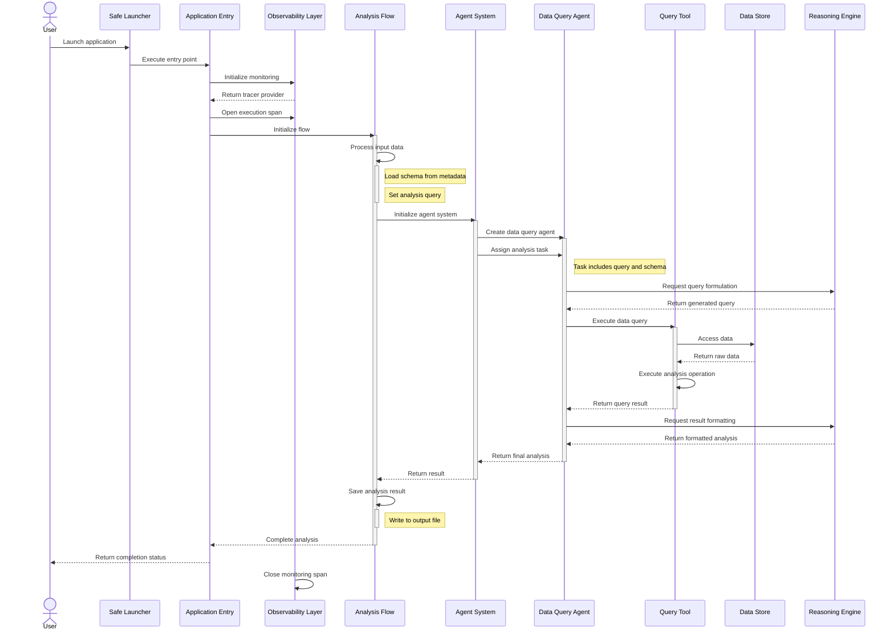

# 2. Data Processing Sequence

## Sequence Description

This sequence diagram illustrates the precise order of operations and interactions between components:

1. **Execution Initiation**
   - User launches the application via the `Safe Launcher`.
   - The application entry point initializes the observability layer.
   - A monitoring span is established for the execution.

2. **Flow Setup**
   - The analysis flow is initialized.
   - Input processing occurs: schema loading and query setup.
   - The flow prepares the state with necessary data.

3. **Agent System Activation**
   - An agent system is initialized with the analysis context.
   - A data query agent is created with domain expertise.
   - A specific task is assigned to the agent with instructions.

4. **Analysis Execution**
   - The agent uses the reasoning engine to formulate a query.
   - The query is executed via the query tool.
   - The tool accesses the data store and runs the analysis operation.

5. **Result Processing**
   - Raw query results are formatted by the reasoning engine.
   - The formatted analysis is returned through the component chain.
   - The analysis result is persisted to storage.

6. **Execution Completion**
   - The flow execution completes.
   - The monitoring span is closed.
   - Completion status is returned to the user.

This sequence accurately reflects the actual execution order in the application code, showing how data and control flow between components.
