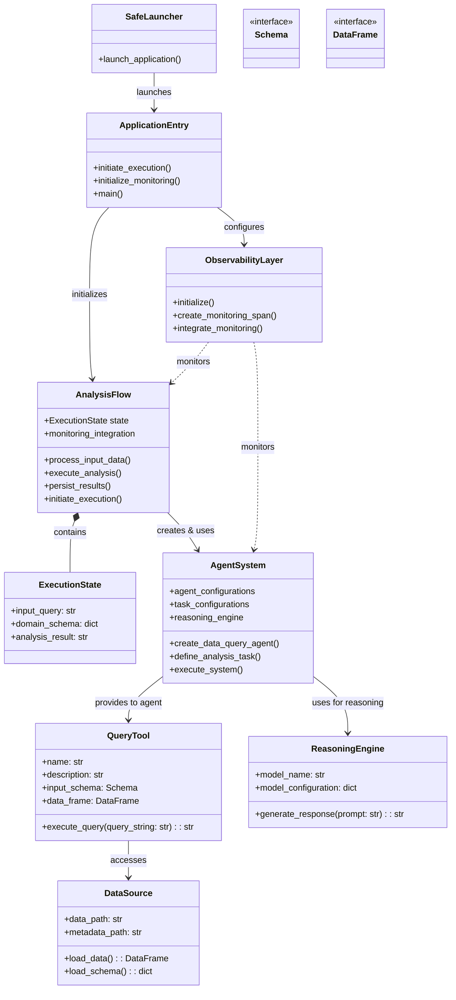

# 3. Component Relationships and Structure

## Component Structure

This diagram shows the structural relationships between the key components of the system:

### Core Components

| Component | Description | Implementation |
|-----------|-------------|----------------|
| **SafeLauncher** | Wrapper for safely launching the application | `main.py` module |
| **ApplicationEntry** | Entry point that initiates the application | `main.py` module with `main()` and `kickoff()` functions |
| **AnalysisFlow** | Orchestrates the analysis steps in sequence | `DataAnalysisFlow` class in `main.py` |
| **ExecutionState** | Maintains the state across execution steps | `DataAnalysisState` class in `main.py` |
| **ObservabilityLayer** | Provides monitoring and telemetry | Phoenix tracer setup in `main.py` |

### Agent Components

| Component | Description | Implementation |
|-----------|-------------|----------------|
| **AgentSystem** | Manages agents and coordinates tasks | `DataAnalysisCrew` class in `data_analysis_crew.py` |
| **ReasoningEngine** | Provides language understanding and generation | `AzureChatOpenAI` instance in `DataAnalysisCrew` |
| **QueryTool** | Executes data operations safely | `PandasQueryTool` class in `pandas_query_tool.py` |

### Data Components

| Component | Description | Implementation |
|-----------|-------------|----------------|
| **DataSource** | Provides access to data and schema | CSV and JSON files accessed via utility functions |
| **Schema** | Interface defining the structure of input | `QueryInput` model in tool definition |
| **DataFrame** | Interface representing tabular data | pandas DataFrame in `PandasQueryTool` |

## Key Relationships

1. **Containment**: AnalysisFlow contains ExecutionState.
2. **Creation**: SafeLauncher launches ApplicationEntry, which creates AnalysisFlow and ObservabilityLayer.
3. **Usage**: AgentSystem uses QueryTool and ReasoningEngine.
4. **Monitoring**: ObservabilityLayer monitors AnalysisFlow and AgentSystem.
5. **Access**: QueryTool accesses DataSource for data operations.

This diagram accurately reflects the component structure and relationships in the codebase, showing how different parts interact while maintaining proper separation of concerns.
