# 4. Detailed Data and Prompt Flow

```mermaid
flowchart LR
    %% User interaction
    User([User]) --> |"Launches"|SafeLauncher["Safe Launcher"]
    SafeLauncher --> |"Initializes"|Flow["Analysis Flow"]
    
    %% Input context setup
    Flow --> |"Sets"|InputQuery["Analysis Query"]
    Flow --> |"Loads"|SchemaData["Domain Schema"]
    
    %% Schema structure
    SchemaData --> |"Contains"|Dimensions["Dimensions Definition"]
    SchemaData --> |"Contains"|Metrics["Metrics Definition"]
    SchemaData --> |"Contains"|Constraints["Domain Constraints"]
    
    %% Agent and task setup
    Flow --> |"Creates"|AgentSystem["Agent System"]
    AgentSystem --> |"Creates"|Agent["Data Query Agent"]
    AgentSystem --> |"Defines"|Task["Analysis Task"]
    
    %% Information passed to agent system
    InputQuery --> |"Included in"|TaskInput["Task Input"]
    SchemaData --> |"Included in"|TaskInput
    TaskInput --> |"Provided to"|Agent
    
    %% Query generation process
    Agent --> |"Identifies"|EntityRecognition["Entity Recognition"]
    Agent --> |"Determines"|IntentDetection["Intent Detection"]
    
    %% Query formulation
    EntityRecognition --> |"Maps to"|DomainEntities["Domain Entities"]
    IntentDetection --> |"Shapes"|QueryOperation["Query Operation"]
    DomainEntities --> |"Used in"|DataQuery["Data Query"]
    QueryOperation --> |"Defines"|DataQuery
    
    %% Tool execution
    Agent --> |"Uses"|QueryTool["Query Tool"]
    DataQuery --> |"Executed by"|QueryTool
    QueryTool --> |"Accesses"|DataStore["Data Store"]
    DataStore --> |"Contains"|Records["Domain Records"]
    
    %% Result processing
    QueryTool --> |"Returns"|RawResults["Raw Results"]
    RawResults --> |"Processed by"|Agent
    Agent --> |"Produces"|FormattedAnalysis["Formatted Analysis"]
    
    %% Result persistence
    FormattedAnalysis --> |"Returned to"|Flow
    Flow --> |"Writes to"|OutputFile["Analysis Output"]
    
    %% Styling
    classDef user fill:#f5f5f5,stroke:#333,stroke-width:2px,stroke-dasharray: 5 5
    classDef input fill:#e3f2fd,stroke:#1565c0,stroke-width:1px
    classDef process fill:#f3e5f5,stroke:#4a148c,stroke-width:1px
    classDef component fill:#d4edda,stroke:#155724,stroke-width:2px
    classDef data fill:#fff3cd,stroke:#856404,stroke-width:1px
    classDef result fill:#e8f5e9,stroke:#1b5e20,stroke-width:1px
    
    %% Style assignments
    class User user
    class SafeLauncher,Flow process
    class InputQuery,SchemaData,Dimensions,Metrics,Constraints,TaskInput input
    class AgentSystem,Agent,Task component
    class EntityRecognition,IntentDetection,DomainEntities,QueryOperation,DataQuery process
    class QueryTool,DataStore,Records data
    class RawResults,FormattedAnalysis,OutputFile result

    %% Legend
    subgraph Legend
        L1["User Interface"]
        L2["Process Components"]
        L3["Input Components"] 
        L4["System Components"]
        L5["Data Components"]
        L6["Result Components"]
    end
    
    class L1 user
    class L2 process
    class L3 input
    class L4 component
    class L5 data
    class L6 result
```

## Data and Prompt Flow Details

This diagram illustrates the detailed flow of data and prompts through the system:

### Input Processing

1. **Query Setup**
   - The application entry initializes the analysis flow.
   - The flow sets an analysis query (from predefined examples).
   - The flow loads the domain schema from metadata.

2. **Schema Structure**
   - The schema contains dimensions (time periods, regions).
   - The schema contains metrics definitions (population counts).
   - The schema includes domain constraints (valid dimension values).

### Agent Processing

3. **Agent Configuration**
   - The agent system is created with specific configuration.
   - A data query agent is created with expertise.
   - An analysis task is defined with structured instructions.

4. **Task Execution**
   - The agent receives the task input with query and schema.
   - The agent performs entity recognition in the query.
   - The agent determines the query intent.

### Query Processing

5. **Query Generation**
   - Recognized entities are mapped to domain entities in the schema.
   - The detected intent shapes the query operations to perform.
   - A data query is constructed from entities and operations.

6. **Data Access**
   - The query tool executes the generated data query.
   - The data store is accessed to retrieve relevant records.
   - Raw query results are returned to the agent.

### Result Processing

7. **Analysis Formation**
   - The agent processes the raw results.
   - A formatted analysis is produced with insights.
   - The analysis is returned to the flow.

8. **Output Generation**
   - The formatted analysis is written to the output file.
   - The results are available for the user.

This diagram shows the precise data transformations and processing steps from initial query to final analysis output, accurately reflecting how information flows through the system components.
