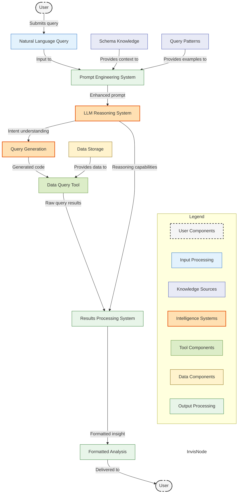

# 5. Simplified Interaction Diagram



## Component Descriptions

| Component | Description |
|-----------|-------------|
| **User** | End user who interacts with the system by submitting queries and receiving analysis |
| **Natural Language Query** | The user's question or request expressed in natural language (Czech or English) |
| **Schema Knowledge** | Structured information about the dataset's organization, dimensions, and metrics |
| **Query Patterns** | Example query structures that guide how to form effective data operations |
| **Prompt Engineering System** | System that combines user query with relevant context and examples |
| **LLM Reasoning System** | AI system that processes inputs, understands intent, and generates logical solutions |
| **Query Generation** | Process that translates the understood intent into executable query code |
| **Data Query Tool** | Component that safely executes generated code against the data store |
| **Data Storage** | Repository containing the structured data to be analyzed |
| **Results Processing System** | System that transforms raw query results into meaningful insights |
| **Formatted Analysis** | Final output presented in human-readable, contextually appropriate format |

## Flow Explanation

The diagram illustrates the high-level conceptual flow of the system:

1. **Query Submission**: User submits a natural language query to the system
2. **Context Enhancement**: 
   - The query is enriched with schema knowledge
   - Query patterns provide structural guidance
3. **Intelligence Processing**:
   - The LLM analyzes the enriched query to understand intent
   - The system generates appropriate query code
4. **Data Interaction**:
   - The query tool executes the code against the data store
   - Raw results are retrieved
5. **Insight Generation**:
   - Results are processed into meaningful insights
   - The system formats the analysis appropriately
6. **Delivery**: The final formatted analysis is delivered to the user

## Technical Explanation

This section maps each high-level component to specific code implementations in the system:

1. **Query Submission**
   - **Code Location**: `main.py` → `kickoff()` function
   - **Implementation**: User input is predefined in a list of example prompts in `DataAnalysisFlow.process_prompt()` where `self.state.prompt = prompts[3]` selects a specific example
   - **Technical Details**: The system currently uses hardcoded prompts rather than direct user input for testing purposes

2. **Schema Knowledge Integration**
   - **Code Location**: `DataAnalysisFlow.process_prompt()` in `main.py`
   - **Implementation**: 
     ```python
     schema_path = get_metadata_file('OBY01PDT01_metadata.json')
     with open(schema_path, 'r', encoding='utf-8') as f:
         self.state.schema = json.load(f)
     ```
   - **Technical Details**: Metadata is loaded from a JSON file containing dimension definitions, valid values, and structural information

3. **Prompt Engineering System**
   - **Code Location**: `tasks.yaml` → `process_prompt` task definition
   - **Implementation**: The task description contains detailed instructions on handling bilingual queries, matching terms to schema, and creating pandas queries
   - **Technical Details**: The system leverages CrewAI's task configuration to structure detailed instructions that guide the LLM's reasoning process

4. **LLM Reasoning System**
   - **Code Location**: `data_analysis_crew.py`
   - **Implementation**:
     ```python
     llm = AzureChatOpenAI(
         deployment_name="gpt-4o__test1",
         model_name="gpt-4o",
         # ...other configuration
     )
     ```
   - **Technical Details**: The system uses Azure OpenAI GPT-4o through the AzureChatOpenAI integration, configured with the specific deployment name and endpoints

5. **Query Generation**
   - **Code Location**: Agent execution path triggered by `Crew.kickoff()` in `DataAnalysisFlow.analyze_data()`
   - **Implementation**: The LLM receives inputs from `crew.kickoff(inputs={"prompt": self.state.prompt, "schema": self.state.schema})`
   - **Technical Details**: The agent system internally prompts the LLM to generate pandas code based on the task description in `tasks.yaml`

6. **Data Query Tool**
   - **Code Location**: `pandas_query_tool.py` → `PandasQueryTool` class
   - **Implementation**:
     ```python
     def _run(self, query: str) -> str:
         try:
             result = eval(query, {'df': self.df, 'pd': pd}, {})
             return str(result)
         except Exception as e:
             return f"Query error: {str(e)}"
     ```
   - **Technical Details**: The tool uses Python's `eval()` function to safely execute generated pandas queries in a controlled environment

7. **Data Storage**
   - **Code Location**: `pandas_query_tool.py` → `PandasQueryTool.__init__`
   - **Implementation**:
     ```python
     def __init__(self, **data):
         super().__init__(**data)
         self.df = pd.read_csv(get_data_file('OBY01PDT01.csv'))
     ```
   - **Technical Details**: CSV data is loaded into a pandas DataFrame when the tool is instantiated

8. **Results Processing System**
   - **Code Location**: Agent processing → LLM functionality for result formatting
   - **Implementation**: After executing the query, the agent uses the LLM to process raw results into meaningful analysis
   - **Technical Details**: The agent implicitly calls back to the LLM with query results to generate the final analysis

9. **Output Delivery**
   - **Code Location**: `DataAnalysisFlow.save_result()` in `main.py`
   - **Implementation**:
     ```python
     def save_result(self):
         print("Saving analysis result")
         with open("analysis_result.txt", "w", encoding='utf-8') as f:
             f.write(self.state.result)
     ```
   - **Technical Details**: The final formatted analysis is written to a text file in the root directory

10. **Component Coordination**
    - **Code Location**: `main.py` → `DataAnalysisFlow` class with decorated methods
    - **Implementation**: The flow uses the decorators `@start()` and `@listen()` to establish the execution sequence
    - **Technical Details**: CrewAI Flow's declarative approach creates a directed graph of operations that execute in the correct sequence
