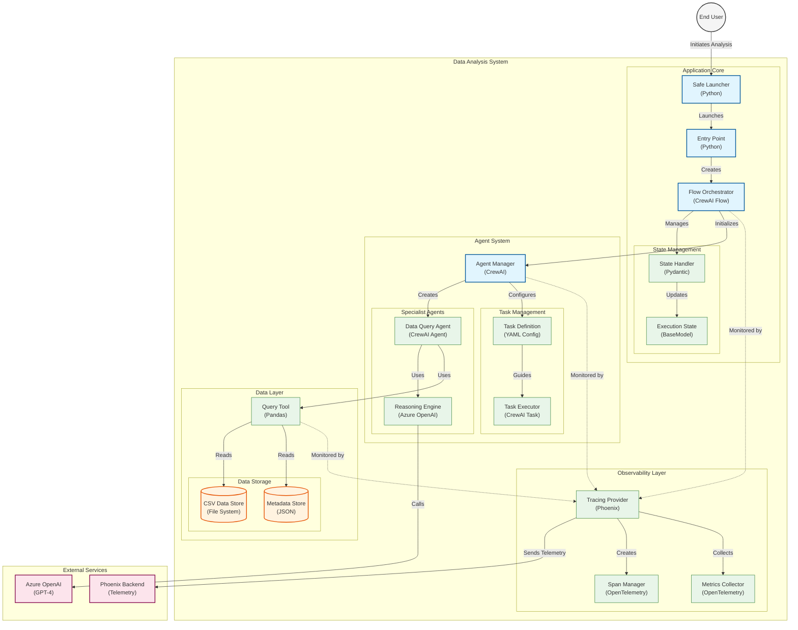

```mermaid
graph TB
    User((End User))

    subgraph "Data Analysis System"
        subgraph "Application Core"
            EntryPoint["Entry Point<br>(Python)"]
            SafeLauncher["Safe Launcher<br>(Python)"]
            FlowOrchestrator["Flow Orchestrator<br>(CrewAI Flow)"]
            
            subgraph "State Management"
                StateHandler["State Handler<br>(Pydantic)"]
                ExecutionState["Execution State<br>(BaseModel)"]
            end
        end

        subgraph "Agent System"
            AgentManager["Agent Manager<br>(CrewAI)"]
            
            subgraph "Specialist Agents"
                DataQueryAgent["Data Query Agent<br>(CrewAI Agent)"]
                ReasoningEngine["Reasoning Engine<br>(Azure OpenAI)"]
            end
            
            subgraph "Task Management"
                TaskDefinition["Task Definition<br>(YAML Config)"]
                TaskExecutor["Task Executor<br>(CrewAI Task)"]
            end
        end

        subgraph "Data Layer"
            QueryTool["Query Tool<br>(Pandas)"]
            
            subgraph "Data Storage"
                CSVDataStore[("CSV Data Store<br>(File System)")]
                MetadataStore[("Metadata Store<br>(JSON)")]
            end
        end

        subgraph "Observability Layer"
            TracingProvider["Tracing Provider<br>(Phoenix)"]
            SpanManager["Span Manager<br>(OpenTelemetry)"]
            MetricsCollector["Metrics Collector<br>(OpenTelemetry)"]
        end
    end

    subgraph "External Services"
        AzureOpenAI["Azure OpenAI<br>(GPT-4)"]
        PhoenixBackend["Phoenix Backend<br>(Telemetry)"]
    end

    %% Core Flow Connections
    User -->|"Initiates Analysis"| SafeLauncher
    SafeLauncher -->|"Launches"| EntryPoint
    EntryPoint -->|"Creates"| FlowOrchestrator
    FlowOrchestrator -->|"Manages"| StateHandler
    StateHandler -->|"Updates"| ExecutionState

    %% Agent System Connections
    FlowOrchestrator -->|"Initializes"| AgentManager
    AgentManager -->|"Creates"| DataQueryAgent
    AgentManager -->|"Configures"| TaskDefinition
    TaskDefinition -->|"Guides"| TaskExecutor
    DataQueryAgent -->|"Uses"| ReasoningEngine
    ReasoningEngine -->|"Calls"| AzureOpenAI

    %% Data Layer Connections
    DataQueryAgent -->|"Uses"| QueryTool
    QueryTool -->|"Reads"| CSVDataStore
    QueryTool -->|"Reads"| MetadataStore

    %% Observability Connections
    TracingProvider -->|"Sends Telemetry"| PhoenixBackend
    TracingProvider -->|"Creates"| SpanManager
    TracingProvider -->|"Collects"| MetricsCollector
    FlowOrchestrator -.->|"Monitored by"| TracingProvider
    AgentManager -.->|"Monitored by"| TracingProvider
    QueryTool -.->|"Monitored by"| TracingProvider

    %% Styling
    classDef container fill:#e1f5fe,stroke:#01579b,stroke-width:2px
    classDef component fill:#e8f5e9,stroke:#2e7d32,stroke-width:1px
    classDef external fill:#fce4ec,stroke:#880e4f,stroke-width:2px
    classDef storage fill:#fff3e0,stroke:#e65100,stroke-width:2px
    classDef user fill:#f5f5f5,stroke:#333,stroke-width:2px

    class User user
    class EntryPoint,SafeLauncher,FlowOrchestrator,AgentManager container
    class StateHandler,ExecutionState,DataQueryAgent,ReasoningEngine,TaskDefinition,TaskExecutor,QueryTool,TracingProvider,SpanManager,MetricsCollector component
    class CSVDataStore,MetadataStore storage
    class AzureOpenAI,PhoenixBackend external
```