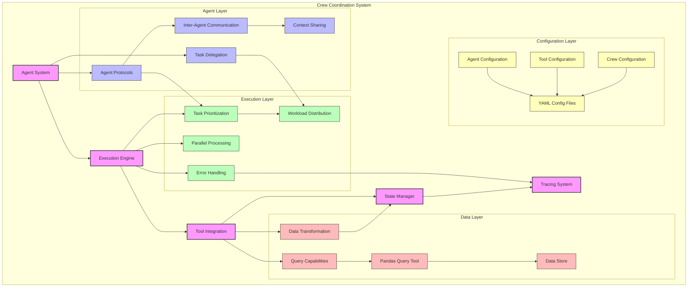

```mermaid
graph TD
    subgraph "Crew Coordination System"
        %% Core Components
        AgentSystem["Agent System"]
        ExecutionEngine["Execution Engine"]
        ToolIntegration["Tool Integration"]
        StateManager["State Manager"]
        TracingSystem["Tracing System"]

        %% Agent Layer
        subgraph "Agent Layer"
            AgentProtocols["Agent Protocols"]
            TaskDelegation["Task Delegation"]
            InterAgentComm["Inter-Agent Communication"]
            ContextSharing["Context Sharing"]
        end

        %% Execution Layer
        subgraph "Execution Layer"
            TaskPrioritization["Task Prioritization"]
            ParallelProcessing["Parallel Processing"]
            ErrorHandling["Error Handling"]
            WorkloadDistribution["Workload Distribution"]
        end

        %% Data Layer
        subgraph "Data Layer"
            DataTransformation["Data Transformation"]
            QueryCapabilities["Query Capabilities"]
            PandasTool["Pandas Query Tool"]
            DataStore["Data Store"]
        end

        %% Configuration Layer
        subgraph "Configuration Layer"
            AgentConfig["Agent Configuration"]
            ToolConfig["Tool Configuration"]
            CrewConfig["Crew Configuration"]
            YAMLConfig["YAML Config Files"]
        end
    end

    %% Core Component Relationships
    AgentSystem --> ExecutionEngine
    ExecutionEngine --> ToolIntegration
    ToolIntegration --> StateManager
    StateManager --> TracingSystem

    %% Agent Layer Relationships
    AgentSystem --> AgentProtocols
    AgentSystem --> TaskDelegation
    AgentProtocols --> InterAgentComm
    InterAgentComm --> ContextSharing

    %% Execution Layer Relationships
    ExecutionEngine --> TaskPrioritization
    ExecutionEngine --> ParallelProcessing
    ExecutionEngine --> ErrorHandling
    TaskPrioritization --> WorkloadDistribution

    %% Data Layer Relationships
    ToolIntegration --> DataTransformation
    ToolIntegration --> QueryCapabilities
    QueryCapabilities --> PandasTool
    PandasTool --> DataStore

    %% Configuration Layer Relationships
    AgentConfig --> YAMLConfig
    ToolConfig --> YAMLConfig
    CrewConfig --> YAMLConfig

    %% Cross-Layer Relationships
    AgentProtocols --> TaskPrioritization
    TaskDelegation --> WorkloadDistribution
    DataTransformation --> StateManager
    ErrorHandling --> TracingSystem

    %% Style Definitions
    classDef core fill:#f9f,stroke:#333,stroke-width:2px
    classDef agent fill:#bbf,stroke:#333,stroke-width:1px
    classDef execution fill:#bfb,stroke:#333,stroke-width:1px
    classDef data fill:#fbb,stroke:#333,stroke-width:1px
    classDef config fill:#ffb,stroke:#333,stroke-width:1px

    %% Style Applications
    class AgentSystem,ExecutionEngine,ToolIntegration,StateManager,TracingSystem core
    class AgentProtocols,TaskDelegation,InterAgentComm,ContextSharing agent
    class TaskPrioritization,ParallelProcessing,ErrorHandling,WorkloadDistribution execution
    class DataTransformation,QueryCapabilities,PandasTool,DataStore data
    class AgentConfig,ToolConfig,CrewConfig,YAMLConfig config
```